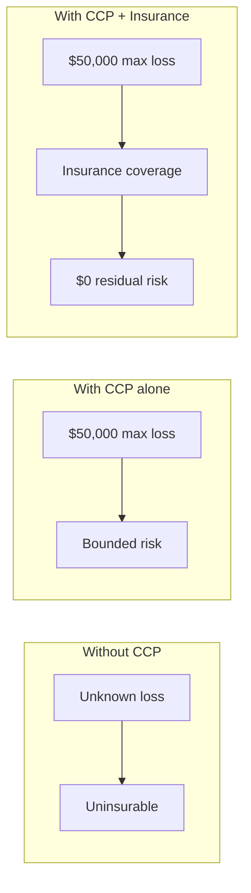

import { Callout } from 'fumadocs-ui/components/callout';

# Insurance Layer

CCP bounds the worst-case loss. Insurance **eliminates the residual risk** for counterparties who want zero-loss guarantees.

## Why Insurance Matters

CCP provides a containment bound — say, "$50,000 maximum loss." But many counterparties want "zero loss." Insurance bridges that gap.

CCP makes agents **insurable** in a way they weren't before, by giving insurers the structured data they need to price risk.

## How Premiums Are Priced

Insurance premiums are based on:

| Factor | Effect on Premium |
|--------|------------------|
| Certificate class (C1/C2/C3) | Higher class → lower premium |
| Reserve ratio | Higher ratio → lower premium |
| Auditor reputation | Established auditor → lower premium |
| Agent track record | Longer clean history → lower premium |
| Containment bound | Higher bound → higher absolute premium |

### Example Pricing

A C2 agent with a $50,000 containment bound, 3× reserve, and independent audit:

- Base rate: ~2.25% of containment bound
- Annual premium: ~$1,125

The same agent without CCP certification might be uninsurable or priced at 10–20× higher.

## The Virtuous Cycle

Insurance creates a powerful feedback loop:

1. **Insurers validate CCP quality** — they only write policies on well-contained agents, creating a second layer of economic scrutiny
2. **Insurance availability attracts operators** — operators certify because it unlocks insurance, which unlocks access to risk-averse counterparties
3. **Claims data improves the system** — insurance actuarial data reveals which containment architectures actually work, feeding back into audit standards

<Callout type="info">
Insurance providers are predicted to become **critical equilibrium stabilizers** in the CCP ecosystem — sophisticated, economically motivated actors who keep the system honest because their capital is on the line.
</Callout>

## Integration with Transactions

Some high-value transaction contexts require **both** a CCP certificate and active insurance:

- DeFi positions above a threshold (e.g., $100k)
- Institutional custody arrangements
- Cross-chain bridge interactions

In these flows, the verifier checks the CCP certificate *and* confirms an active insurance policy references it. If the certificate lapses, the insurance may also lapse — creating self-enforcing containment maintenance.
