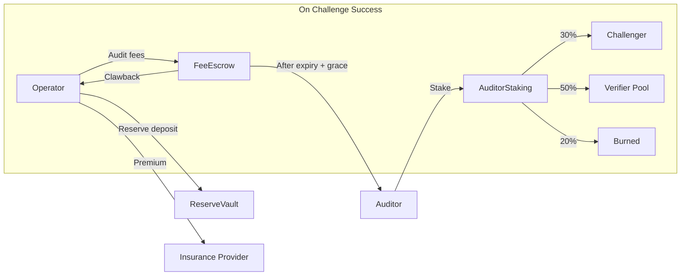

import { Callout } from 'fumadocs-ui/components/callout';

# Money Flows

CCP itself charges **zero protocol fees** — like TCP/IP, it's a free standard. But participants pay real costs and earn real revenue within the ecosystem.

## Flow Overview

## Normal Operation

In the happy path — which should be the vast majority of cases — money flows are straightforward:

1. **Operator deposits reserve** into a `ReserveVault` contract. This is collateral, not a fee — it's returned when the certificate expires and the grace period ends, provided no claims are made.
2. **Operator pays audit fee** held in `FeeEscrow`, released to the auditor after certificate expiry plus grace period.
3. **Auditor locks a stake** in `AuditorStaking` proportional to the containment bound they're attesting to (C2: 3%, C3: 5%). Released after the certificate expires plus a grace period.

No money leaves the system unless something goes wrong.

## Challenge Scenario

When a challenger successfully proves containment has degraded:

| Source | Recipient | Share |
|--------|-----------|-------|
| Auditor stake | Challenger | 30% |
| Auditor stake | Verifier pool | 50% |
| Auditor stake | Burned | 20% |
| Fee escrow | Clawed back to operator | 100% |

The burn component prevents collusion — even if challenger and auditor are the same entity, value is destroyed.

## Protocol Sustainability

CCP charges no fees. The protocol is sustained through:

- **Grants and ecosystem funding** during early phases
- **Corporate sponsorship** from integrators who benefit from the standard
- **Optional premium tooling** (SDK features, dashboards) as a fallback

<Callout type="info">
The zero-fee design is intentional. A protocol that charges rent creates incentives for forks and workarounds. CCP grows by being the cheapest possible standard to adopt.
</Callout>
