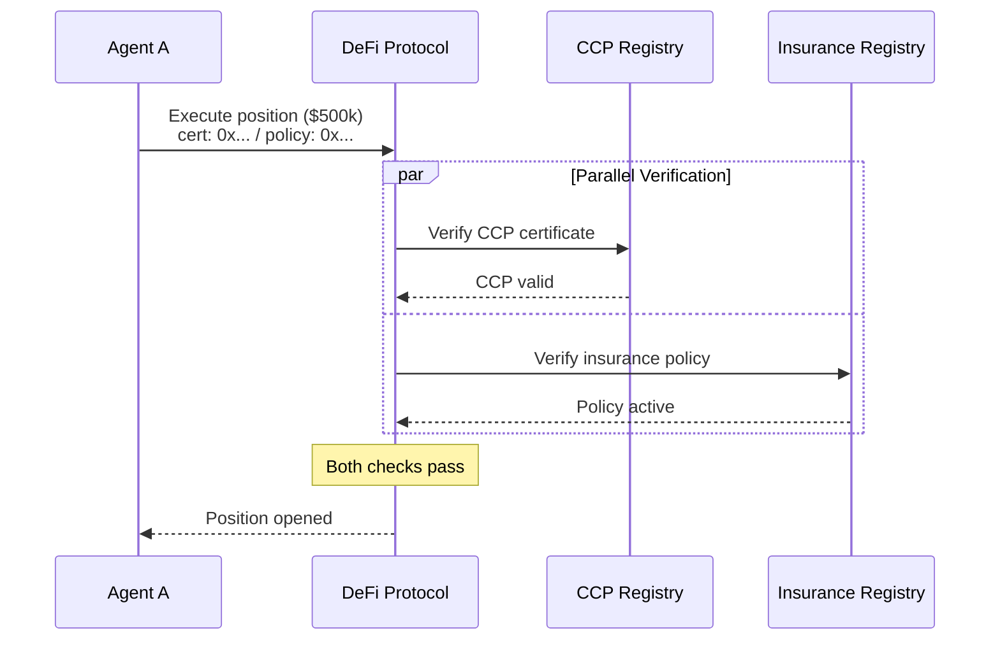

# DeFi Integration

DeFi protocols face a unique challenge: autonomous agents can interact with smart contracts directly, without any human in the loop. CCP provides the missing trust layer.

## The Problem

A lending protocol has no way to distinguish between:
- A well-contained agent with $150k in reserve backing a $50k deposit
- A rogue agent about to execute a complex exploit

Without CCP, the protocol must either accept all agents (risky) or block all agents (missing the market).

## On-Chain Verification

DeFi integrations verify CCP certificates **entirely on-chain** — no oracles, no off-chain services.

```solidity
contract CCPGatedPool {
    ICCPRegistry public immutable ccpRegistry;
    uint256 public constant CCP_THRESHOLD = 10_000e6; // $10k USDC

    function deposit(uint256 amount, bytes32 certHash) external {
        if (amount > CCP_THRESHOLD) {
            require(ccpRegistry.isValid(certHash), "CCP: invalid cert");

            (, , uint256 bound, , uint8 status, ) =
                ccpRegistry.getCertificate(certHash);

            require(status == 1, "CCP: cert not active");
            require(bound >= amount, "CCP: bound too low");
        }

        _processDeposit(msg.sender, amount);
    }
}
```

**Gas overhead**: ~35,000 gas (~$0.05–$0.50 depending on chain and gas price).

## Insurance-Gated High-Value Operations

For operations above a higher threshold (e.g., $100k), protocols can require **both** CCP and active insurance:



If the CCP certificate lapses, the insurance policy may also lapse — creating a self-enforcing maintenance loop.

## Tiered Access

Protocols can define access tiers based on certificate class:

| Certificate | Access Level |
|------------|-------------|
| None | Up to $1,000 (open access) |
| C1 | Up to $10,000 |
| C2 | Up to $100,000 |
| C3 | Up to $1,000,000+ |
| C3 + Insurance | Unlimited |

This lets protocols progressively open access to agents as their containment quality improves, without binary accept/reject decisions.

## Concentration Risk

Smart DeFi protocols also monitor **concentration risk** from CCP:

- What percentage of TVL is from agents attested by the same auditor?
- What percentage of TVL is from agents using the same containment contract?
- What percentage of TVL is from agents operated by the same entity?

If any concentration exceeds a threshold (e.g., 20%), the protocol can restrict new deposits from that category until diversification improves.
