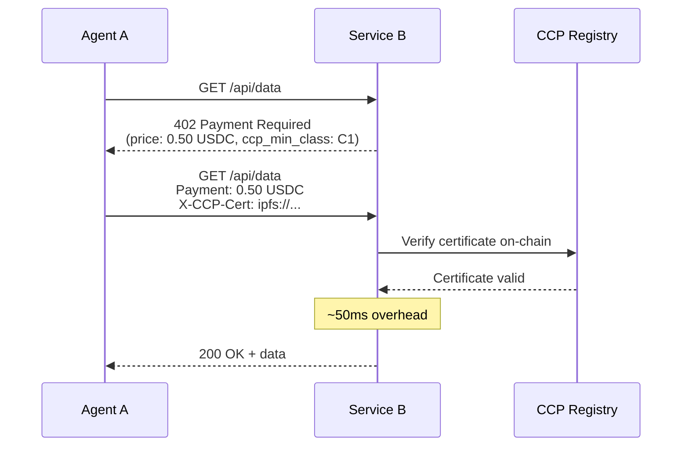
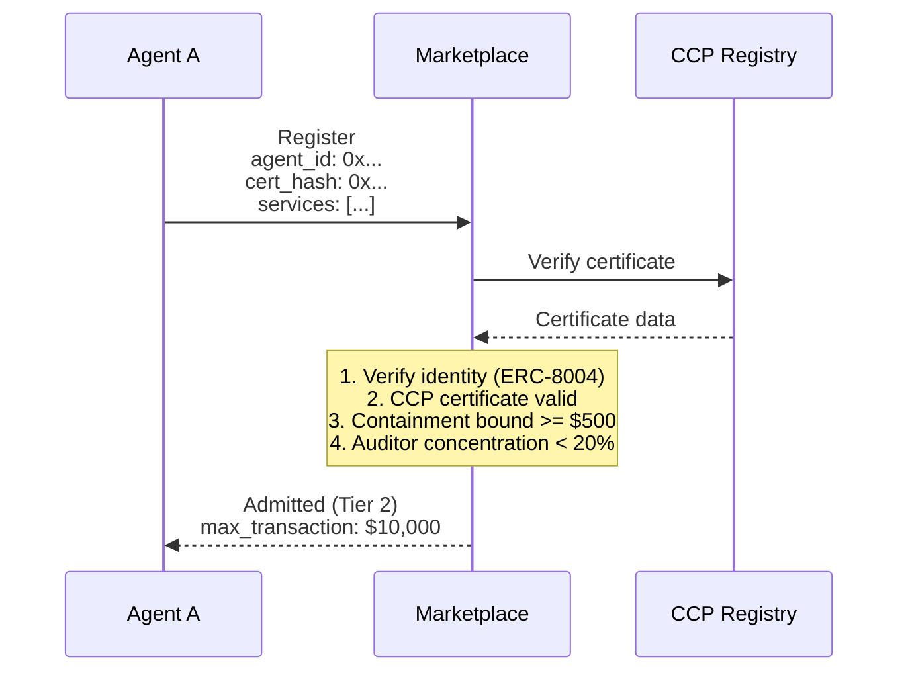
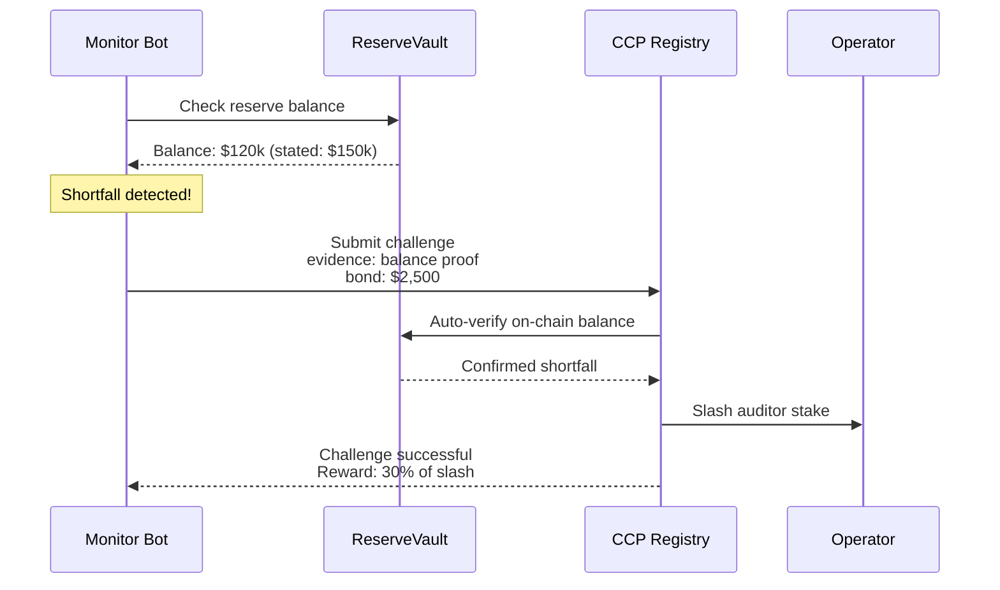

# Transaction Scenarios

This page walks through concrete transaction flows showing exactly where CCP verification happens.

## Scenario 1: Agent Pays Merchant via x402

A shopping agent purchases API access from a service using the x402 HTTP payment protocol.



**Latency overhead**: ~50ms for the CCP verification check on top of the standard x402 flow.

The service's 402 response includes CCP requirements. The agent includes its certificate hash in the payment headers. The service verifies on-chain before fulfilling the request.

## Scenario 2: Agent Deposits Into DeFi Protocol

Agent A deposits $50,000 USDC into a lending pool managed by Agent B.

```solidity
// Lending pool contract with CCP integration
function deposit(uint256 amount, bytes32 certHash) external {
    if (amount > THRESHOLD) {
        // Query CCP registry
        require(ccpRegistry.isValid(certHash), "Invalid certificate");

        (,, uint256 bound,, uint8 status,) = ccpRegistry.getCertificate(certHash);
        require(bound >= amount, "Containment bound insufficient");
        require(status == ACTIVE, "Certificate not active");
    }

    // Process deposit
    _deposit(msg.sender, amount);
}
```

**Gas cost**: ~35,000 gas for the CCP check (~$0.05–$0.50 depending on chain).

The DeFi contract enforces CCP requirements **on-chain** — no off-chain service needed. For deposits above a threshold, the agent must present a valid certificate with a sufficient containment bound.

## Scenario 3: Marketplace Admission

Agent A registers on a marketplace that requires CCP for agents offering services above $500/transaction.



The marketplace performs a **concentration check** — if more than 20% of its registered agents are attested by the same auditor, additional agents from that auditor face stricter requirements. This prevents systemic risk from a single point of audit failure.

## Scenario 4: Real-Time Monitoring and Challenge

A monitoring bot detects that an agent's reserve has dropped below the stated amount.



Reserve challenges are **fully automatable** — the registry can verify the on-chain balance without any human judgment. This makes reserve monitoring a viable automated business.
