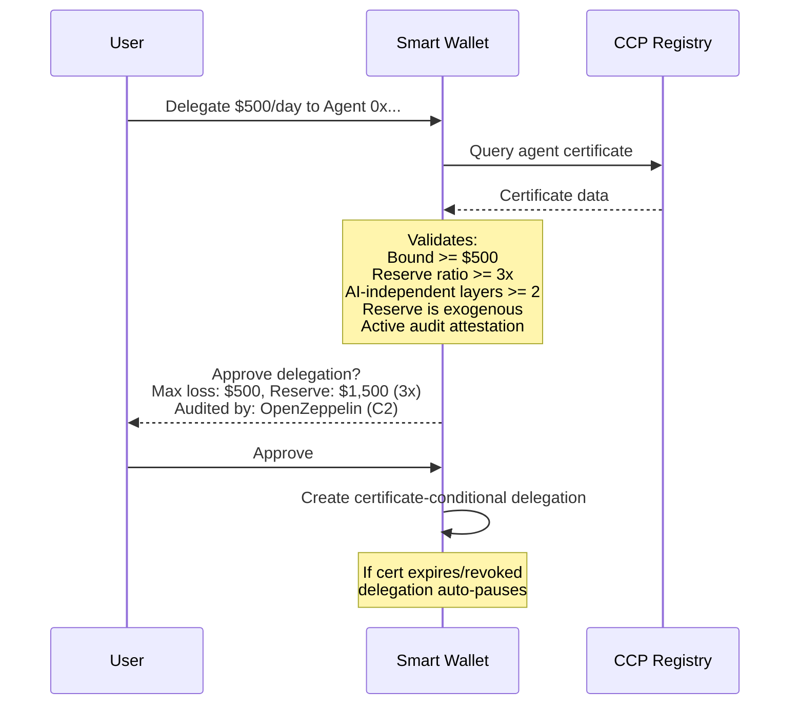

import { Callout } from 'fumadocs-ui/components/callout';

# Wallet Delegation

When a human user delegates spending authority to an AI agent, the wallet can use CCP to enforce safety requirements.

## The Flow

A user wants to delegate $500/day spending to their AI shopping agent. The wallet requires CCP for delegations above $100/day.



## Certificate-Conditional Delegation

The delegation is **bound to the certificate's validity**. This is the key innovation:

- If the certificate **expires** → delegation auto-pauses
- If the certificate is **revoked** → delegation auto-pauses
- If the certificate is **challenged** → delegation auto-pauses

The agent must maintain a valid certificate to keep its spending authority. No human needs to monitor this — the smart contract enforces it.

```solidity
// Simplified ERC-7710 delegation with CCP condition
function executeDelegated(address agent, bytes calldata data) external {
    Delegation memory d = delegations[agent];
    require(d.active, "No delegation");
    require(d.amount <= d.dailyLimit, "Over limit");

    // CCP condition check
    if (d.ccpRequired) {
        bytes32 certHash = ccpRegistry.getAgentCertificate(agent);
        require(ccpRegistry.isValid(certHash), "CCP cert invalid");
    }

    // Execute
    _execute(agent, data);
}
```

## User-Facing Risk Summary

The wallet presents CCP data in plain language:

```
┌─────────────────────────────────────┐
│  Agent Delegation Request           │
│                                     │
│  Agent: ShopBot v3.1                │
│  Requesting: $500/day spending      │
│                                     │
│  Risk Reduction Breakdown:          │
│  ██████████░░  Spend cap      35%   │
│  ████████░░░░  MPC auth       28%   │
│  ██████░░░░░░  Reserve        22%   │
│  ████░░░░░░░░  Time lock      10%   │
│  ██░░░░░░░░░░  Audit           5%   │
│                                     │
│  Worst case: $500 (if all          │
│  containment layers hold)           │
│  Backed by: $1,500 USDC reserve    │
│  Audited by: OpenZeppelin (C2)     │
│                                     │
│  [Approve]  [Reject]  [Details]    │
└─────────────────────────────────────┘
```

<Callout type="info">
The risk reduction percentages are derived from Shapley value attribution — each containment layer's marginal contribution to total risk reduction. This replaces raw mathematical notation with an intuitive visual that any user can understand.
</Callout>

## Compatible Wallet Standards

| Standard | Integration Point |
|----------|------------------|
| ERC-7710 | Session key delegation with CCP condition |
| ERC-4337 | Account abstraction UserOp validation includes CCP check |
| OWS (Open Wallet Standard) | Agent wallet with CCP-aware signing policies |
