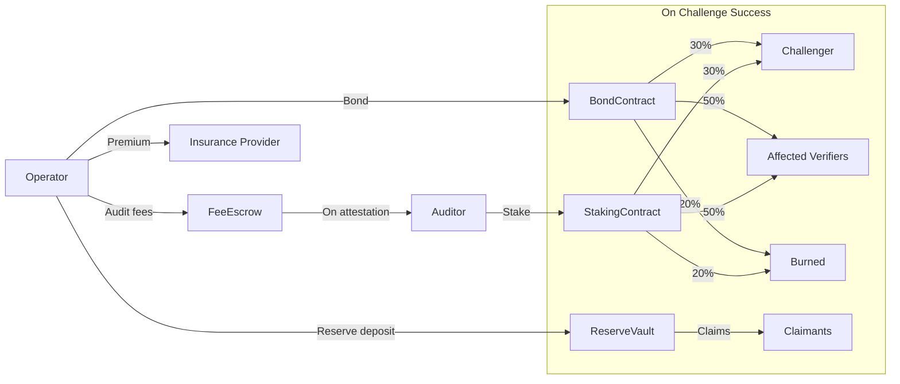

import { Callout } from 'fumadocs-ui/components/callout';

# Money Flows

CCP itself charges **zero protocol fees** — like TCP/IP, it's a free standard. But participants pay real costs and earn real revenue within the ecosystem.

## Flow Overview

## Normal Operation

In the happy path — which should be the vast majority of cases — money flows are straightforward:

1. **Operator deposits reserve** into a smart contract vault. This is collateral, not a fee — it's returned when the certificate expires or is renewed, provided no claims are made.
2. **Operator posts a bond** (5–10% of containment bound). Also returned if no challenge succeeds.
3. **Operator pays audit fee** held in escrow, released to the auditor upon attestation.
4. **Auditor locks a stake** proportional to the containment bound they're attesting to. Released after the certificate expires plus a grace period.

No money leaves the system unless something goes wrong.

## Challenge Scenario

When a challenger successfully proves containment has degraded:

| Source | Recipient | Share |
|--------|-----------|-------|
| Operator bond | Challenger | 30% |
| Operator bond | Affected verifiers | 50% |
| Operator bond | Burned | 20% |
| Auditor stake | Same distribution | 30% / 50% / 20% |
| Reserve | Direct claimants | As needed |

The burn component prevents collusion — even if challenger and operator are the same entity, value is destroyed.

## Protocol Sustainability

CCP charges no fees. The protocol is sustained through:

- **Grants and ecosystem funding** during early phases
- **Corporate sponsorship** from integrators who benefit from the standard
- **Optional premium tooling** (SDK features, dashboards) as a fallback

<Callout type="info">
The zero-fee design is intentional. A protocol that charges rent creates incentives for forks and workarounds. CCP grows by being the cheapest possible standard to adopt.
</Callout>
