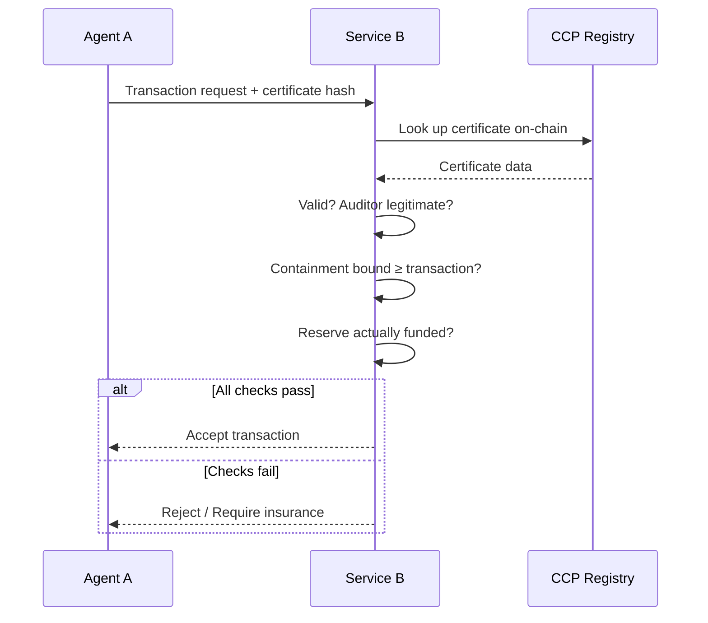

import { Callout } from 'fumadocs-ui/components/callout';

# Protocol Explained

CCP is a standard that lets anyone answer one question about an AI agent:

> **"If this agent goes wrong, what is the maximum I can lose?"**

Not "will it go wrong?" — but "how bad can it get, and who pays?"

---

## The Problem: Trusting a Robot With Money

AI agents are starting to transact autonomously — buying API access, executing trades, managing funds. But every counterparty faces the same dilemma: **how do you do business with software that might behave unpredictably?**

The instinct is to build a reputation system. Track the agent's history, score it, let good scores unlock more access. But this breaks down for AI agents in ways it doesn't for humans or companies.

### Why reputation fails for agents

Think of it this way. Imagine a restaurant review system, but:

- **The chef changes every night** — the model behind an agent can be updated, fine-tuned, or swapped at any time. Yesterday's 5-star chef is not today's chef.
- **Any chef can open a new restaurant for free** — if an agent builds a bad reputation, the operator can just deploy a new one. Fresh identity, clean slate. (This is the Sybil problem.)
- **The chef improvises every dish** — LLMs are stochastic. The same prompt can produce different outputs. A good track record doesn't guarantee the next interaction.

A restaurant rating system would be useless under these conditions. So is agent reputation.

---

## The Insight: Bound the Loss, Not the Behavior

CCP takes a fundamentally different approach. Instead of trying to predict whether an agent will behave well, it asks: **what physical and economic constraints make it impossible for the agent to cause more than X dollars of damage?**

### Analogy: The Bank Vault, Not the Bank Teller

When you deposit money at a bank, you don't rely on trusting every individual teller. The system is designed so that:

1. **The vault has a time lock** — no single person can open it on demand
2. **Withdrawals require multiple signatures** — no one person can move large amounts
3. **The bank carries insurance** — even if everything else fails, deposits are covered up to a limit
4. **Auditors verify all of this** — independent parties confirm the controls actually work

You trust the *architecture*, not the individuals.

CCP does the same thing for AI agents:

| Bank | CCP |
|------|-----|
| Vault with time lock | Smart contract spending limits the agent can't override |
| Multi-signature withdrawals | MPC or multi-sig authorization for large transactions |
| FDIC insurance | Exogenous reserve (collateral) backing residual risk |
| Annual bank audit | Independent auditor attests containment layers work |

The result is a **containment certificate** — a machine-readable, on-chain document that says: "This agent's worst-case loss is bounded to $X, here are the constraints that enforce it, and here is $Y in collateral backing the residual risk."

---

## The Key Distinction: What the Agent Can't Touch

Not all safety measures are equal. CCP draws a sharp line between two kinds:

### Agent-independent containment (the load-bearing walls)

These are constraints the agent **physically cannot circumvent**, no matter how clever it gets:

- A smart contract that caps spending at $1,000/day — the agent can't modify Solidity code on-chain
- A hardware security module (HSM) that requires a physical key to sign large transactions
- A multi-party computation (MPC) setup where 3 of 5 human keyholders must approve

**Analogy: The fish tank.** A fish can be as creative as it wants inside the tank. It can't change the glass. The glass is agent-independent containment.

### Agent-influenceable containment (the curtains)

These depend on humans or systems the agent can interact with:

- A human supervisor who reviews transactions — but the agent could craft a convincing justification
- An API rate limit — but the operator could raise it if the agent asks nicely enough
- A reputation score — but the agent could game it

**Analogy: A "Please Do Not Enter" sign.** It works on most people, most of the time. But it's not a locked door.

<Callout type="info">
CCP certificates must declare which containment layers are agent-independent and which are agent-influenceable. Only agent-independent layers count toward the containment bound — the guaranteed worst-case limit.
</Callout>

---

## The Trust Stack: Three Layers

CCP doesn't rely on a single mechanism. It stacks three complementary layers:

### 1. Containment (the walls)

Agent-independent constraints that physically limit what the agent can do. This is the foundation — everything else builds on top.

**Analogy: Seatbelts and airbags.** They don't prevent crashes, but they cap how bad the outcome can be. And they work whether the driver is careful or reckless.

### 2. Reserve (the insurance fund)

Real money (USDC, ETH — not the operator's own token) locked in a smart contract. If containment fails and someone loses money, the reserve pays out.

**Analogy: A security deposit.** When you rent an apartment, the landlord holds a deposit. If you trash the place, the deposit covers the damage. The deposit must be in real money — the landlord won't accept an IOU written on your own napkin.

### 3. Reputation (the track record)

The operator's history of running agents well. This is useful but explicitly the *weakest* layer — it can't substitute for containment or reserves.

**Analogy: A driver's record.** Good to know, helpful for pricing insurance, but it doesn't replace the seatbelt.

---

## Certificate Classes: How Rigorous?

Not every agent needs the same level of assurance. CCP defines three tiers:

| | C1 — Basic | C2 — Standard | C3 — Institutional |
|---|---|---|---|
| **Reserve** | 1x max periodic loss | 3x max periodic loss | 5x max periodic loss |
| **Audit** | Self-attestation | Independent audit required | Full-stack audit + formal verification |
| **Expiry** | 90 days | 60 days | 30 days |
| **Use case** | Small tips, micro-APIs | E-commerce, moderate DeFi | Treasury management, high-value DeFi |

**Analogy: Building inspections.** A garden shed (C1) needs a basic permit. A house (C2) needs a licensed inspector. A hospital (C3) needs the most rigorous structural, electrical, and seismic review — and it gets re-inspected more often.

---

## How Verification Works

When Agent A wants to transact with Service B:

This entire flow can be **fully automated** — no humans in the loop. Two agents can verify each other's certificates and transact in milliseconds.

**Analogy: A passport at the border.** You don't need to explain your life story. You present a standardized document, the officer checks it against a database, and you're either admitted or not. CCP certificates are passports for AI agents entering economic spaces.

---

## Who Are the Players?

| Role | What they do | Real-world parallel |
|------|-------------|-------------------|
| **Operator** | Deploys the agent, builds containment, funds reserve | Building owner who installs fire safety systems |
| **Auditor** | Independently verifies containment works, co-signs certificate, stakes money on their attestation | Building inspector who signs off on fire safety — and is personally liable if it's wrong |
| **Verifier** | Any counterparty that checks a certificate before transacting | Insurance company that checks your fire safety rating before writing a policy |
| **Challenger** | Monitors the ecosystem, flags certificates where containment has degraded | Whistleblower who reports a building's fire exits are blocked |

---

## Why Honest Behavior Wins

CCP is designed so that **playing by the rules is the most profitable strategy** for every participant:

- **Operators** who cut corners on containment risk losing their bond (5-10% of containment bound) and their reserve. The cost of cheating exceeds the savings.
- **Auditors** stake their own money on every attestation. If they sign off on bad containment and get challenged, they lose their stake. Honest auditing has ~39% margins; dishonest auditing has negative expected returns.
- **Challengers** earn 30% of slashed funds when they successfully flag bad certificates. Monitoring the system is a viable business.

**Analogy: Health inspections for restaurants.** The restaurant (operator) pays for proper food safety because the fine for a violation exceeds the savings from cutting corners. The health inspector (auditor) checks rigorously because their license is on the line. And any customer (challenger) can report a violation.

---

## What CCP Is Not

- **Not a reputation system** — it doesn't score agent behavior
- **Not a prediction engine** — it doesn't try to forecast what agents will do
- **Not a governance token** — there's no CCP token, no voting, no fees
- **Not a walled garden** — the registry is permissionless; anyone can publish and verify

CCP is infrastructure. Like TCP/IP defines how data packets are structured and routed, CCP defines how containment claims are structured and verified. It doesn't charge tolls. It sets a standard.

---

## One Sentence Summary

> CCP is an open standard that lets any counterparty — human or machine — verify, in milliseconds, that an AI agent's worst-case economic damage is bounded and backed by real collateral.
