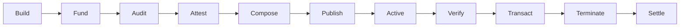
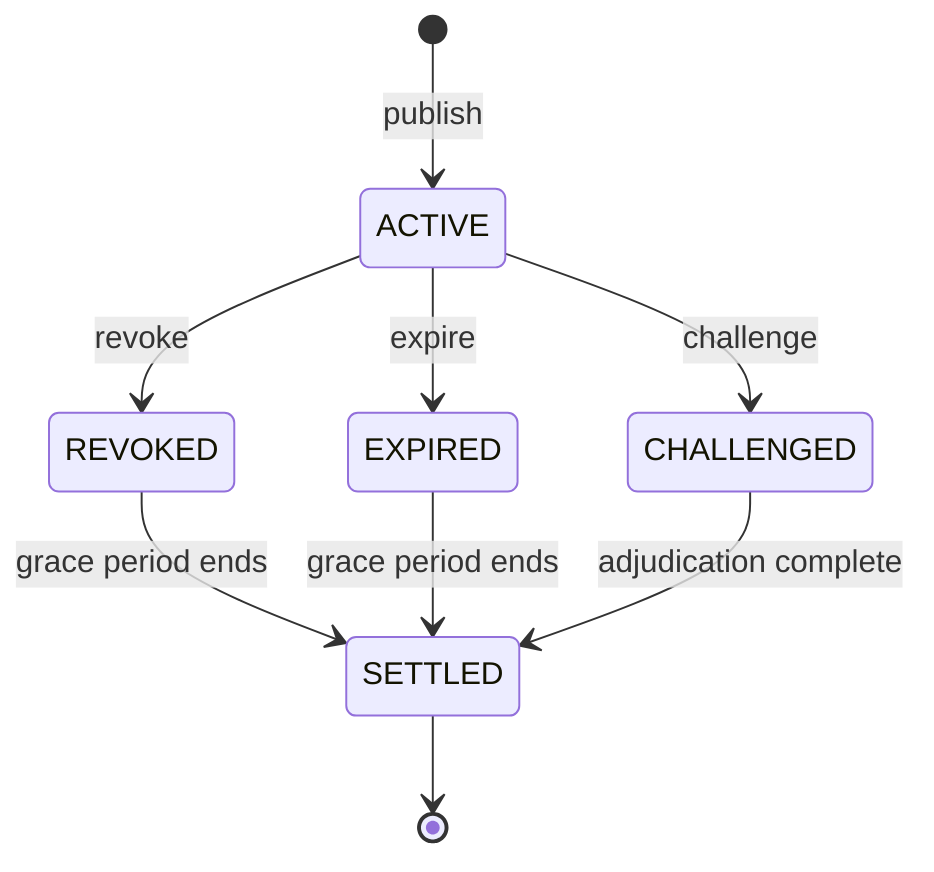

import { Callout } from 'fumadocs-ui/components/callout';

# Protocol Lifecycle

A containment certificate moves through 12 stages from creation to settlement. This page walks through each one.

## Stage Overview

## Stages in Detail

### 1. Build Containment Architecture

The operator designs and deploys the agent's containment system:
- Smart contracts with spending limits, time locks, permission boundaries
- Execution environment (TEE, HSM, MPC as applicable)
- Recovery mechanisms (kill switches, pause functions, reversibility windows)

Each constraint is classified as **agent-independent** or **agent-influenceable**.

### 2. Fund Reserve and Operator Bond

The operator deposits:
- **Reserve** — collateral in exogenous assets (USDC, ETH, DAI) into a `ReserveVault` contract
- **Operator bond** — slashable deposit (5–10% of containment bound) into a `BondContract`

Both are locked for the certificate's lifetime plus a grace period.

### 3. Request Audit

For C2/C3 certificates, the operator engages an independent auditor:
- Defines audit scope based on certificate class
- Deposits audit fee into `FeeEscrow`
- Provides auditor with access to containment architecture and source code

### 4. Audit Containment

The auditor examines the containment system across five surfaces:

| Surface | What's Tested |
|---------|--------------|
| Spending limits | Source code review, deployment verification, constraint testing |
| Permission model | Privilege escalation testing, agent independence assessment |
| Reserve | Balance verification, lock-up verification, exogeneity check |
| Execution environment | TEE attestation, HSM configuration, MPC threshold |
| Recovery mechanisms | Kill switch testing, pause functions, reversibility windows |

For C3 certificates, **composition analysis** is also required — mapping every path money can take and verifying constraints cover all paths.

### 5. Attest and Stake

The auditor:
1. Produces an audit report with findings and recommendations
2. Signs the certificate attestation (scoped to what was actually verified)
3. Locks their stake in the `StakingContract`

The audit fee is released from escrow to the auditor.

### 6. Compose Certificate

The full certificate object is assembled with all required fields:
- Identity (certificate ID, agent ID, operator ID, chain ID)
- Validity (issued timestamp, expiry timestamp, status)
- Constraints (each with type, value, enforcement mechanism, agent-independence flag)
- Reserve details (amount, denomination, contract address, exogenous flag)
- Derived metrics (containment bound, layer counts)
- Attestations (auditor signatures and scopes)

### 7. Publish

1. Certificate data is uploaded to **IPFS** (content-addressed, immutable)
2. The IPFS hash is registered on-chain via `ICCPRegistry.registerCertificate()`
3. On-chain event emitted for indexers and monitors

### 8. Certificate Goes Active

The registry returns `isValid = true` for this certificate. Counterparties can now query it.

### 9–10. Verification

When a counterparty wants to transact:

1. **Lookup** — query `ICCPRegistry` with the agent's address
2. **Retrieve** — fetch full certificate from IPFS
3. **Validate** — check signatures, schema, completeness
4. **Check status** — confirm `ACTIVE` (not `REVOKED` or `EXPIRED`)
5. **Evaluate** — apply their own risk policy against certificate data
6. **Concentration check** — optional check for auditor/contract concentration
7. **Decision** — accept, reject, or require additional conditions

### 11. Termination

A certificate ends in one of three ways:

| Outcome | Trigger | Effect |
|---------|---------|--------|
| **Renewal** | Operator submits updated certificate before expiry | New certificate replaces old; old marked `EXPIRED` |
| **Revocation** | Operator or auditor calls `revokeCertificate()` | Certificate marked `REVOKED` immediately |
| **Expiry** | Clock passes `expires_at` timestamp | Certificate marked `EXPIRED` automatically |

### 12. Settlement

After termination plus grace period:

- **No challenge**: Operator bond returned, auditor stake returned, reserve unlocked
- **Successful challenge**: Bond slashed, stake slashed, reserve used for claims

## Typical Timeline (C2)

| Day | Event |
|-----|-------|
| 0 | Operator begins building containment architecture |
| 7–14 | Containment deployed, reserve funded, audit requested |
| 14–21 | Audit completed, attestation signed |
| 22 | Certificate published on-chain |
| 22–82 | Certificate active (60-day validity) |
| 75 | Renewal audit begins (if continuing) |
| 82 | Certificate expires |
| 82–96 | Grace period (challenges still possible) |
| 96 | Settlement — all funds released if no challenge |

## State Machine

<Callout type="info">
Certificate state transitions are recorded on-chain and are irreversible. An `EXPIRED` certificate cannot become `ACTIVE` again — the operator must publish a new one.
</Callout>
